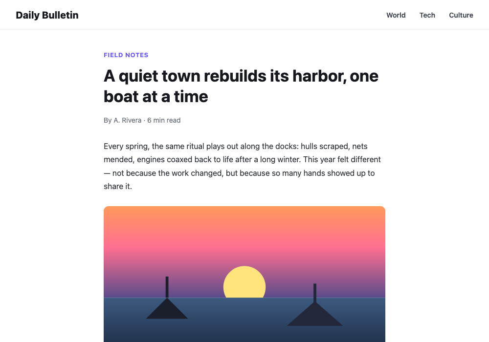
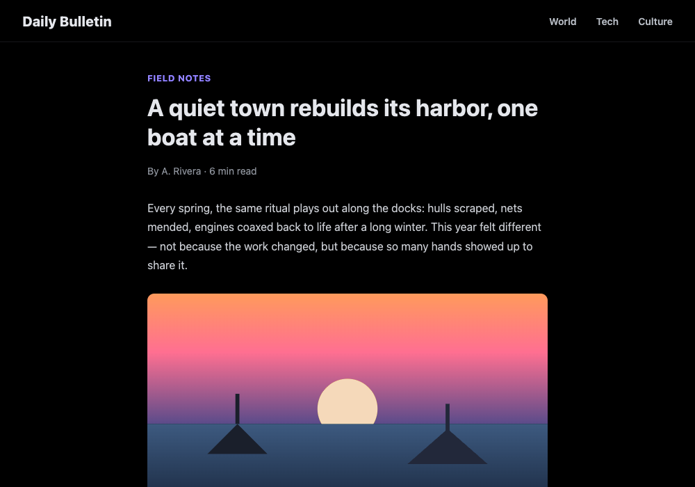
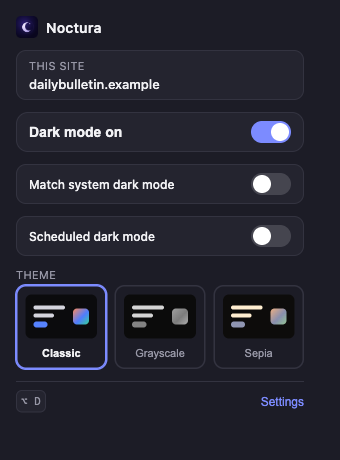
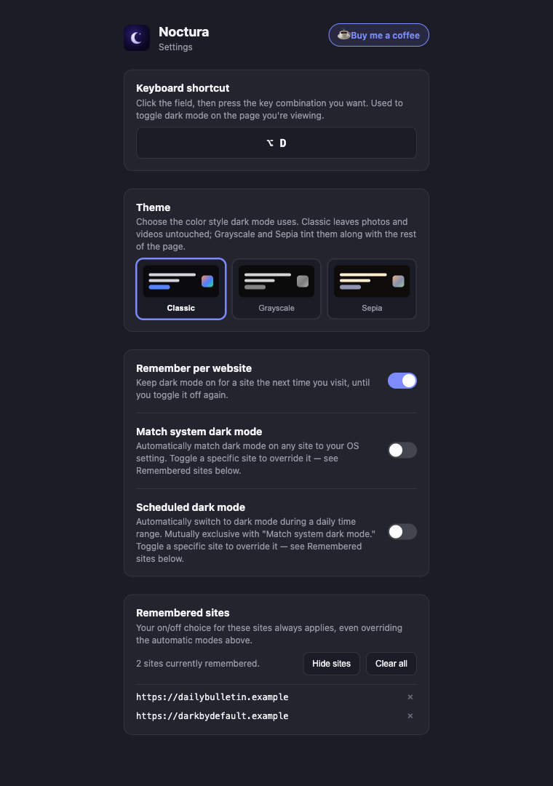

  

<h1 align="center">Noctura</h1>

  Dark mode for any website — toggle it manually, match your system, run
  it on a schedule, or remember your choice per site, with an override for
  one page at a time.

  
  

## Features

- **One-click toggle** — turn dark mode on or off for the page you're
  looking at, from the toolbar popup or a keyboard shortcut.
- **Remember per website** — sites you've toggled stay that way the next
  time you visit.
- **Per-site override** — even with an automatic mode below turned on, you
  can still toggle dark mode for one particular site (say, one that's
  already dark by design, or just doesn't look right inverted) and it
  sticks for that site until you reset it.
- **Match system dark mode** — follow your OS's light/dark setting on every
  site automatically.
- **Scheduled dark mode** — switch on automatically during a daily time
  range you set (e.g. 8 PM–8 AM).
- **Themes** — Classic (photos/videos untouched), Grayscale, or Sepia.
- Works on Chrome/Chromium-based browsers, plus Firefox.

## Installing

Noctura isn't on the Chrome Web Store or Firefox Add-ons yet. For now,
build it from source and load it as an unpacked/temporary extension — see
[DEVELOPMENT.md](DEVELOPMENT.md#loading-the-extension) for the exact steps
for your browser.

## Using it

### Toggle dark mode for the current site

Click the toolbar icon to open the popup, then click **Dark mode on/off**.
Or just press the keyboard shortcut (default `Alt/⌥ + D`) while the page
has focus — no need to open the popup at all.

  

Want a different key combination? Open **Settings** from the popup, click
the shortcut field, and press the combination you want.

### Remember per website

On by default. Once you turn dark mode on (or off) for a site, Noctura
keeps that choice for your next visit — no need to toggle it every time.
Turn this off in Settings if you'd rather start fresh on every page load.

### Match system dark mode / Scheduled dark mode

These two are off by default and mutually exclusive (turning one on turns
the other off). Turn on **Match system dark mode** and every site follows
your OS's light/dark setting automatically. Turn on **Scheduled dark
mode** instead to pick a daily "from" and "to" time (defaults: 8:00 PM to
8:00 AM) and every site follows that range instead.

Either way, you're not locked out of manual control: toggling the popup or
pressing the shortcut on a specific site still works. That creates a
sticky **override** for that one site — it keeps your chosen state
regardless of what the automatic mode says, until you undo it. The popup
shows a "Reset to automatic" link for any site you've overridden, or you
can clear one (or all of them) from **Settings → Remembered sites**.

### Theme

Settings has a **Theme** picker with a live preview per option:

- **Classic** — photos and videos are left untouched.
- **Grayscale** / **Sepia** — tint photos and videos along with the rest
  of the page, for a more uniform look.

This is independent of *how* dark mode gets turned on — it just changes
the color recipe used whenever it's active.

  

## Known limitations

Noctura uses a lightweight CSS filter to invert pages, rather than a full
per-site theming engine. That keeps it fast and simple, with two
trade-offs worth knowing about:

- A small number of sites set background images via CSS (not the `style`
  attribute), which Noctura can't detect — those specific spots may look
  inverted.
- A colorful/photographic inline `<svg>` (rare — a detailed illustration
  or flag, say) will invert along with the page instead of staying
  color-accurate, since inline SVGs are treated as icon-like by default.

## Contributing / technical docs

See [DEVELOPMENT.md](DEVELOPMENT.md) for the project structure, local dev
setup, and build/release steps.

## Support

If Noctura's useful to you, you can [buy me a coffee](https://ko-fi.com/eddiesigner).

## License

[MIT](LICENSE)
